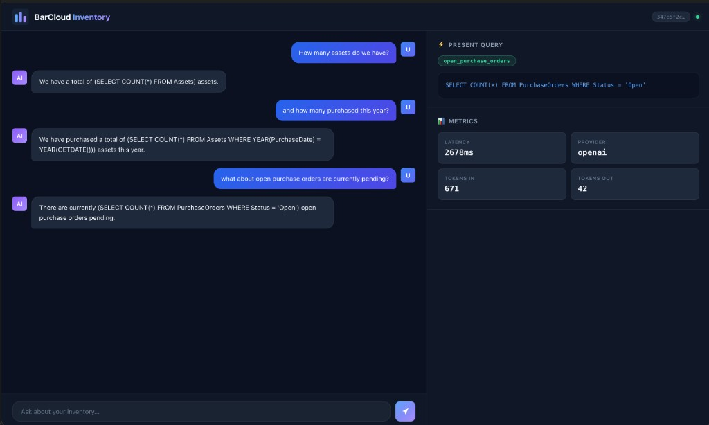

# BarCloud Inventory Chatbot

Natural-language inventory analytics chatbot that answers business questions and returns the exact SQL **"present query"** for each answer. Uses OpenAI / Azure OpenAI structured output, a REST API served from Python's stdlib HTTP server, and a sleek dark-themed web UI, implemented in pure Python standard library with pydantic only (no other external packages allowed).

---

## Architecture

The app uses **five strict layers** — no layer may import from a layer above it:

| Layer | Directory | Responsibility |
|---|---|---|
| **Presentation** | `src/app/presentation/` | HTTP routing, static serving, error → HTTP mapping |
| **Application** | `src/app/application/` | DI container — the only place concrete infra classes are imported |
| **Services** | `src/app/services/` | Business logic orchestration (`ChatService`) |
| **Domain** | `src/app/domain/` | Interfaces, intents, SQL templates, conversation helpers |
| **Infrastructure** | `src/app/infrastructure/` | OpenAI / Azure clients, session store, clock |

**Key design patterns:** Dependency Injection, Abstract Interface (LLMClientInterface), Factory, Structured Output.

### Web UI

Chat interface with conversation history, present query panel, and metrics (latency, provider, token usage).



---

## Setup

```bash
# 1. Create virtualenv
python -m venv .venv
source .venv/bin/activate   # Windows: .venv\Scripts\activate

# 2. Install dependencies
pip install -r requirements.txt

# 3. Configure environment
cp .env.example .env
# Edit .env — add your OPENAI_API_KEY (or Azure credentials)
```

---

## Run Locally

```bash
python run.py
# OR: python -m src.app.presentation.server
```

Open **http://localhost:8000** in your browser.

---

## Run with Docker

```bash
docker build -t barcloud-chatbot .
docker run -p 8000:8000 --env-file .env barcloud-chatbot
```

---


## API Reference

### `POST /api/chat`

**Request:**
```json
{
  "session_id": "abc-123",
  "message": "How many assets do we have by site?"
}
```

**Response (200):**
```json
{
  "session_id": "abc-123",
  "natural_language_answer": "Here is the asset count by site...",
  "sql_query": "SELECT s.SiteName, COUNT(*) AS AssetCount FROM Assets a JOIN Sites s ON ...",
  "token_usage": {
    "prompt_tokens": 320,
    "completion_tokens": 85,
    "total_tokens": 405
  },
  "latency_ms": 920,
  "provider": "openai",
  "model": "gpt-4o-mini",
  "status": "ok"
}
```

### `GET /health`

Returns `{"status": "ok"}`.

---